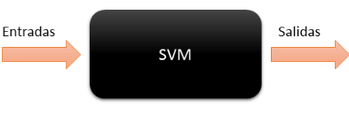
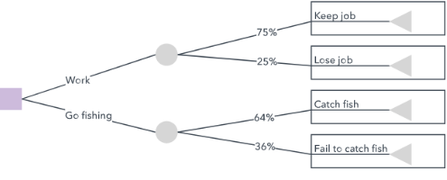
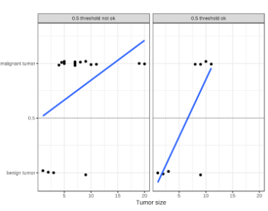
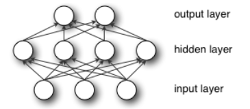
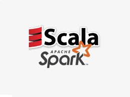
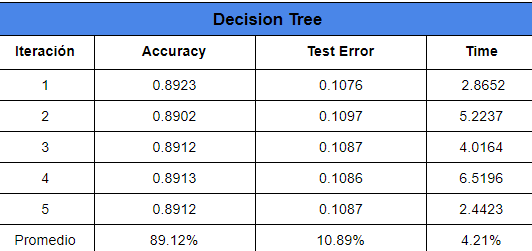
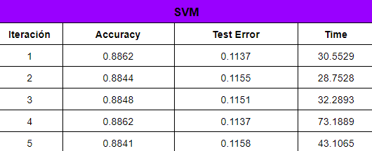

## Index
- [Introduction](#introduction)
- [Theoretical Framework of the Algorithms](#theoretical-framework-of--the-algorithms)
- [SVM](#svm)
- [Decision Tree](#decision-tree)
- [Logistic Regression](#logistic-regression)
- [Multilayer Perceptron](#multilayer-perceptron)
- [Implementation](#implementation)
- [Results](#results)
- [Conclusion](#conclusion)
- [References](#references)


### Introduction


### Theoretical Framework of the Algorithm
### SVM
Support Vector Machines is a supervised learning algorithm that can be used for binary classification or regression.
In both cases, this resolution is based on a first phase of training and a second phase of use for problem solving, they need to first train with situations in which they are told the correct answer on many examples, and once she has trained, enters the "use" phase, and simply becomes a box that returns the response to a new case




Optimal classification is done by maximizing the margin of separation between classes. The vectors that define the edge of this gap are the support vectors. In the event that the classes are not linearly separable, we can use the kernel trick to add a new dimension where they are.
Support vector machines belong to a class of Machine Learning algorithms called kernel methods and are also known as kernel machines.

SVM training consists of two phases:
Transform predictors (input data) into a highly dimensional feature space. In this phase it is enough to specify the kernel; the data is never explicitly transformed into the feature space. This process is commonly known as the kernel trick.
Solve a quadratic optimization problem that fits an optimal hyperplane to classify the transformed features into two classes. The number of transformed features is determined by the number of support vectors.
To construct the decision surface, only the selected support vectors from the training data are required. Once trained, the rest of the training data is irrelevant.

To conclude, SVMs allow you to find the optimal way to classify between various classes.

### Decision Tree

A decision tree is a flowchart like the tree structure, where each internal node denotes a test in an attribute, each branch represents a result of the test, and each leaf node (terminal node) has a class label.

The decision tree is a supervised machine learning technique to induce a decision tree from the training data, it is a predictive model, a mapping from observations on an element to conclusions about its objective value. In tree structures, leaves represent classifications (also called labels), leafless nodes are characteristics, and branches represent conjunctions of characteristics that lead to classifications
DTs are classified using a hierarchical set of characteristics decisions. The decisions made in the internal nodes are the divided criteria, each sheet is assigned to a class or its probability.



### Logistic Regression

It is the appropriate regression analysis to perform when the dependent variable is dichotomous (binary). Like all regression analyzes, logistic regression is predictive analysis.
It is used to describe data and explain the relationship between a dependent binary variable and one or more independent nominal, ordinal, interval, or ratio level variables, solving classification problems, so it is called a Classification Algorithm that models probability of the output class.
Unlike linear regression, in logistic regression, the required output is represented in discrete values ​​as binary 0 and 1
Estimate the relationship between a dependent variable (target) and one or more independent variables (predictors) where the dependent variable is categorical / nominal.


Example:
A linear model classifies tumors as malignant (1) or benign (0) given their size. The lines show the prediction of the linear model. For the data on the left, we can use 0.5 as the classification threshold. After introducing a few more cases of malignant tumors, the regression line changes and a threshold of 0.5 no longer separates the classes. Points are slightly altered to reduce excessive tracing.



Logistic regression types
 + Binary logistic regression
   The categorical answer has only two 2 possible outcomes. Example: spam or not.
 + Multinomial logistic regression
  Three or more unordered categories. Example: predict which food is most preferred (Veg, No Veg, Vegan).
 + Ordinal logistic regression
  Three or more categories with orders. Example: movie rating from 1 to 5.

### Multilayer Perceptron

A multilayer perceptron (MLP) is a direct-feed artificial neural network that generates a set of outputs from a set of inputs. An MLP is characterized by multiple layers of connected input nodes as a directed graph between the input and output layers, which means that the signal path through the nodes only goes in one direction.
Each node, apart from the input nodes, has a nonlinear activation function. An MLP uses backward propagation as a supervised learning technique. Since there are multiple layers of neurons,
MLP is a deep learning technique, it is widely used to solve problems that require supervised learning, as well as research in computational neuroscience and parallel distributed processing. Applications include voice recognition, image recognition, and machine translation.



Example:
We have buildings and pedestrians become points now. Red dots represent objects on the left side of the street; the green dots represent those on the right. The street becomes discontinuous and continuous lines.


Support Vector Machine (the "road machine") is responsible for finding the decision limit to separate the different classes and maximize the margin.
The margins are the distances (perpendicular) between the line and the points closest to the line.

### Implementation

To carry out the different algorithms as well as their comparison we use Apache Spark with Scala this is an object oriented programming language very similar to Java. It has functional language features.
Within the world of Big Data, there is talk of Scala since Spark, which is one of the platforms used to process Big Data data, is made with Scala.

What is Spark?
Apache Spark is an open-source cluster computing framework. Spark is made with Scala and is responsible for transforming the data into an element called RDD (Resilient Distributed Dataset). This is an immutable array that is processed using maps and reduce.



As a code editor we use visual studio, this is quite simple to use and interactive.


### Results

Once all the libraries necessary to carry out each algorithm have been imported, the dataset that we will be working on must be declared. In this case, "bank-full.csv". .
We define the same data in each of the algorithms as follows:
```scala
// We minimize errors
Logger.getLogger ("org"). SetLevel (Level.ERROR)

// We create a simple spark session
val spark = SparkSession.builder (). getOrCreate ()

// We create a simple spark session
val spark = SparkSession.builder (). getOrCreate ()
```

Once everything necessary is declared, we implement each of the algorithms:

** Logistic Regression
```scala
// We divide our set into 30% and 70%
// We put the algorithm into practice
val logistic = new LogisticRegression (). setMaxIter (10) .setRegParam (0.3) .setElasticNetParam (0.7)
```

** Multilayer Perceptron Classifier
```scala
// create the MultilayerPerceptronClassifier trainer and set its parameters
val trainer = new MultilayerPerceptronClassifier (). setLayers (layers) .setBlockSize (128) .setSeed (1234L) .setMaxIter (100)
```

** Decision Tree
```scala
// We create the DecisionTree algorithm
val DecisionT = new DecisionTreeClassifier (). setLabelCol ("indexedLabel"). setFeaturesCol ("indexedFeatures")
```

** SVM
```scala
// Create an SVM object
val SVM = new LinearSVC (). setLabelCol ("indexedLabel"). setFeaturesCol ("indexedFeatures")
```

To obtain the model implementation results we use the following in each of the algorithms as well as the error test:
```scala
// We evaluate the accuracy
val evaluator = new MulticlassClassificationEvaluator (). setLabelCol ("indexedLabel"). setPredictionCol ("prediction"). setMetricName ("accuracy")
println (s "Testsetaccuracy = $ {evaluator.evaluate (predictionAndLabels)}")
val accuracy = evaluator.evaluate (predictions)
println (s "Test Error = $ {(1.0 - accuracy)}")
```

To obtain the times that were carried out:
```scala
// We calculate the time
val t1 = System.nanoTime
val duration = (System.nanoTime - t1) / 1e9d
```
**Tables





### Conclusion


### References

[1] Martinez Heras, J. (s. F.). Support Vector Machines (SVM). Retrieved June 15, 2020, from https://iartificial.net/maquinas-de-vectores-de-soporte-svm/

[2] Joaquín Amat Rodrigo j.amatrodrigo@gmail.com. (2017, April). Support Vector Machines (SVMs). Retrieved June 15, 2020, from https://www.cienciadedatos.net/documentos/34_maquinas_de_vector_soporte_support_vector_machines#m%C3%A1quinas_de_vector_soporte

[3] Álvarez, J. (2016, December 22). Machine Learning and Support Vector Machines: because time is money. Retrieved June 15, 2020, from https://www.analiticaweb.es/machine-learning-y-support-vector-machines-porque-el-tiempo-es-dinero-2/

[4] ScienceDirect. (s. f.). Decision Trees - an overview | ScienceDirect Topics. Retrieved June 16, 2020, from https://www.sciencedirect.com/topics/computer-science/decision-trees

[5] Rokach, L., & Maimon, O. Z. (2014). Data Mining With Decision Trees: Theory And Applications (2Nd Edition) (Machine Perception and Artificial Intelligence) (2nd ed. Ed.). ., Wspc.

[6] A. (2020, May 18). Knowledge Capsules # 1 - Big Data - Spark - Scala. Retrieved June 17, 2020, from https://www.serquo.com/blog/big-data/#:%7E:text=Apache%20Spark%20es%20un%20framework,medio%20de%20maps%20y%20reduces .

[7] Liu, A. (2016). Apache Spark Machine Learning Blueprints. Zaltbommel, The Netherlands: Van Haren Publishing.

[8] Gupta, R. (2019). Hands-On Data Analysis with Scala: Perform data collection, processing, manipulation, and visualization with Scala (1st ed.). .,.: Packt Publishing.
